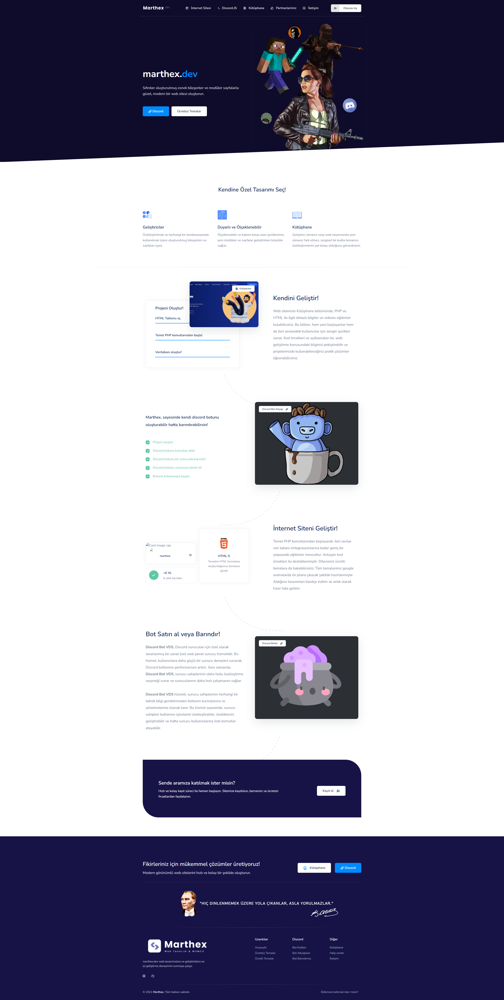

# Panelli PHP Teması

Bu proje, **Panelli PHP Teması** olarak adlandırılmış olup, yaklaşık 1 yıl önce sıfırdan backend ve frontend geliştirmelerine başlandığı bir projedir. Proje sürecinde pek çok şey öğrenilmiş olsa da, tema geliştirilme aşamasında yarım kalmıştır. Mevcut haliyle temel fonksiyonları çalışır durumda olup, kullanmak isteyenler veya projeyi geliştirmek isteyenler için iyi bir başlangıç noktası sunmaktadır.

---

## Özellikler

- **Admin Paneli:** Yönetim işlemlerini gerçekleştirmek için kapsamlı bir panel.
- **Kullanıcı İşlemleri:** Giriş, kayıt ol gibi temel kullanıcı fonksiyonları.
- **Destek Talebi:** Kullanıcıların destek taleplerini iletebileceği bir sistem.
- **Ürün Ekleme:** Ürün yönetimi için ekleme işlemleri.
- **Kütüphane Yönetimi:** Dosya ekleme özelliği; blog olarak da kullanılabilir.
- **Çoklu Admin Rolü:** Birden fazla admin rol ayarlama desteği.

---

## Kurulum

1. **Database Ayarları:**  
   `user/db.php` dosyası içinde veritabanı bilgilerinizi girmeniz gerekmektedir.

2. **SQL Dosyasının Yüklenmesi:**  
   Projede yer alan SQL dosyasını (`marthexd_sonayak.sql`) phpMyAdmin üzerinden içeri aktarın.

3. **Site Kurulumu:**  
   Kurulum tamamlandıktan sonra, web sitesi üzerinden kayıt olun.

4. **Admin Yetkilendirmesi:**  
   Kayıt işlemi tamamlandıktan sonra, veritabanı içindeki `users` tablosundan kendinize admin yetkisi verin. (Bu işlem için SQL sorgusu ile ilgili kaydın yetki sütununu güncelleyebilirsiniz.)

---

## Notlar

- Proje eksiklikler içermektedir; geliştirme süreci tamamlanamamıştır.
- Mevcut haliyle temel fonksiyonlar çalışmaktadır.
- Geliştirme yapmak isteyenler için kaynak kodlar açık kaynak olarak paylaşılmıştır.

---
## Görüntü 

